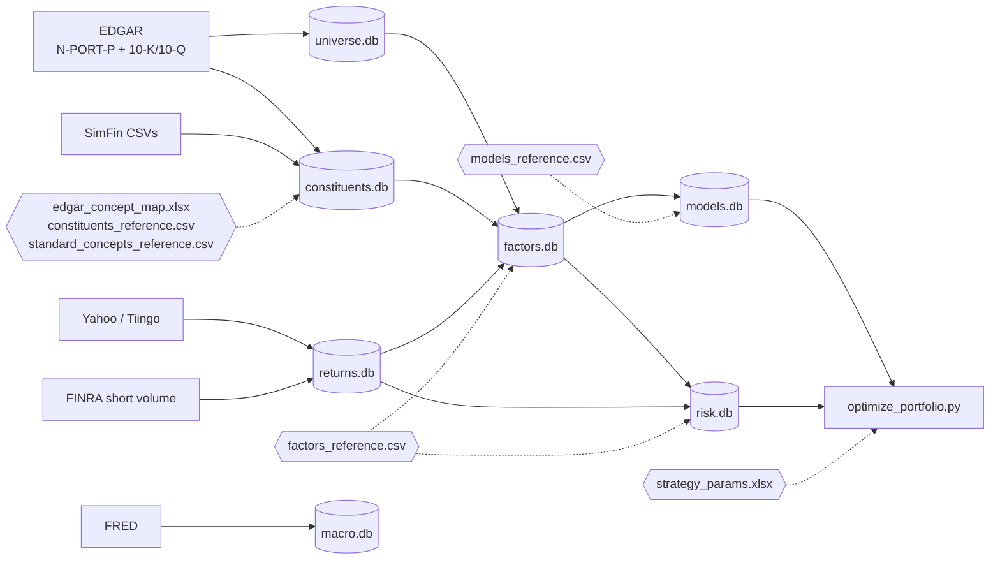

# Systematic Equity Investment Framework

A systematic quantitative investing framework covering ~994 US equities from the **iShares Russell 1000 ETF** universe. Includes 28+ factors across 11 models, a Barra-style factor risk model, and a CVXPY portfolio optimiser with configurable strategies.

> **Note:** This is a public display mirror of a private working repository. It documents the full architecture, but some components are intentionally excluded — all generated data (the `data/` directory and its databases), live brokerage execution tooling, and a few private data-ingestion modules. As a result, certain files referenced below (e.g. `pipeline/update_constituents.py`) are not present here, and the pipeline is not runnable end-to-end from this repo alone. It is shared to illustrate design and methodology.

## Sample report

[**AI Industrials — thematic basket research**](https://thequantfather.github.io/quant-systematic-equity/reports/ai_industrials_theme.html) — point-in-time research (2026-05-29) on the AI capex industrial winners (Vertiv, Eaton, GE Vernova, Quanta Services, Comfort Systems, EMCOR, nVent, Hubbell, Generac, Cummins). Cap-weighted Alpha z, Barra factor exposures, performance vs benchmarks, per-name fundamentals and model-z heatmap, plus bull/bear/verdict narrative. Generated by the `/theme` skill.

## Architecture

```
iShares N-PORT-P (EDGAR)
  └─ pipeline/create_universe.py      → universe.db           (company metadata, ISIN-based)

SimFin CSVs (initial load)
  └─ pipeline/create_databases.py     → constituents.db        (financial time series, PIT)

EDGAR 10-K filings (incremental)
  └─ pipeline/update_constituents.py  → constituents.db

SimFin CSVs
  └─ pipeline/create_returns.py       → returns.db             (daily prices)

constituents.db + returns.db + universe.db
  └─ pipeline/create_factors.py       → factors.db             (28+ factors × N snapshots)
  └─ pipeline/create_models.py        → models.db              (11 models × N snapshots)
  └─ pipeline/create_risk.py          → risk.db                (Ledoit-Wolf covariance, all snapshots)
  └─ pipeline/create_barra.py         → risk.db                (Barra factor risk model, quarterly snapshots)

strategy_params.xlsx + models.db + risk.db
  └─ optimize_portfolio.py   → portfolio_output/      (weights + summary per strategy)

factors.db + models.db + universe.db + portfolio_output/ + risk.db
  └─ app.py + pages/         → Streamlit dashboard
```

## Running the pipeline

```bash
conda activate quant   # Python 3.13.5
```

### Full historical build
```bash
python -m pipeline.create_universe
python -m pipeline.create_databases
python -m pipeline.create_returns
python -m pipeline.create_svr --backfill
python -m pipeline.create_factors --quarterly-backfill   # all quarterly snapshot dates
python -m pipeline.create_models
python -m pipeline.create_risk --backfill
python -m pipeline.create_barra --backfill               # quarterly snapshots → risk.db
python -m pipeline.create_strategy_params        # creates data/strategy_params.xlsx
python optimize_portfolio.py            # runs all active strategies
streamlit run app.py
```

### Rebuild universe snapshots only (leaves companies table intact)
```bash
python -m pipeline.create_universe --rebuild-snapshots
```

### Weekly incremental update
```bash
python -m pipeline.update_constituents [--limit N] [--ticker X] [--sector-type financial] [--force]
# --fill-gaps: pull missing annual 10-K years for a targeted subset of companies
python -m pipeline.create_returns --update       # latest Yahoo Finance prices
python -m pipeline.create_svr                    # latest FINRA short volume ratio (incremental)
python -m pipeline.create_factors --date 2026-04-01
python -m pipeline.create_models --date 2026-04-01
python -m pipeline.create_risk --date 2026-04-01
python -m pipeline.create_barra                  # defaults to most recent Friday → risk.db
# --date is repeatable for create_factors, create_models, create_barra: --date D1 --date D2
python optimize_portfolio.py
```

### Optimizer only
```bash
python optimize_portfolio.py --strategy core_active   # single strategy
python optimize_portfolio.py --list                   # list all strategies
```

## Factor model

### Snapshot dates

Snapshot dates are defined in a `snapshot_schedule` table (`universe.db`) and stored in `factors.db`'s `snapshot_dates` table — there is no hardcoded date list. The whole pipeline (`create_factors` → `create_models` → `create_risk` → `create_barra`) discovers the dates automatically, so adding or shifting snapshots is a single-table change. The grid is month-end monthly history with annual April-1 anchors (≥ 90-day lag after each December FY-end so all filers have reported).

### Point-in-time

Each snapshot uses the most recent annual report with `publish_date ≤ snapshot_date`. Prices as of `snapshot_date`. EDGAR rows use `acceptance_datetime`; SimFin rows use SimFin's publish_date.

### Factors (28+ total)

| Category | Count | Examples |
|----------|-------|---------|
| Quality | 15 | Gross Margin, ROE, ROA, Current Ratio, Leverage, Debt-to-Assets |
| Value | 5 | Earnings Yield, Book-to-Price, Sales-to-Price, Cash Yield, EV-to-EBIT |
| Growth | 5 | Revenue, Earnings, Cash Flow, Asset, Equity Growth |
| Momentum | 2 | 6M, 12M price momentum |
| Size | 1 | Log Market Cap |
| Low Volatility | 1 | Realized volatility (inverted) |
| Liquidity | 1 | Amihud illiquidity (inverted) |
| REIT-only | 3 | FFO Yield, FFO per Share, FFO Growth |

Direction is applied only at model score time (`z × weight × direction`); `factor_value_z` is always stored unsigned.

### Models (11 total)

| Model | ID | Components |
|-------|----|-----------|
| Profitability | PROF001 | Margins, ROE/ROA/ROIC, FCF, cash conversion, gross profit to assets |
| Defensive Quality | DEF001 | Leverage, debt-to-assets, interest coverage, accruals, asset turnover, working capital |
| Value | VAL001 | Earnings/book/sales/cash yields, EV-to-EBIT, EV/EBITDA, dividend yield |
| Growth | GRO001 | Asset, earnings, revenue, equity, cash flow, operating income, EBITDA growth |
| Momentum | MOM001 | 12-month (60%) + 6-month (40%) risk-adjusted momentum |
| Size | SIZ001 | Log Market Cap |
| Low Volatility | LVOL001 | Realized volatility |
| Liquidity | LIQ001 | Amihud illiquidity |
| Short Interest | SHI001 | FINRA SVR 20-day avg (70%) + 90-day percentile rank (30%) |
| Long-term Reversal | LTR001 | 36-12 risk-adjusted reversal (standalone, not in Alpha) |
| Alpha (composite) | ALP001 | 0.25 Profitability + 0.05 Defensive + 0.25 Value + 0.20 Growth + 0.20 Momentum + 0.05 Size |

## Barra factor risk model

### Overview

Barra-style factor covariance decomposition: **Σ = X F X' + Δ**

| Symbol | Description |
|--------|-------------|
| X (N×K) | Factor exposure matrix — market intercept, sector dummies, style z-scores, beta, fundamentals |
| F (K×K) | Factor covariance — two-half-life EWMA. Variances (diag): hl=90d + Newey-West (5 lags). Correlations (off-diag): hl=240d. Reassembled F = D^½ R D^½, annualised. |
| Δ (N×N) | Diagonal idiosyncratic variance — EWMA (hl=60d), Bayesian-shrunk, annualised |

### Factor structure

| Group | Count | Factors |
|-------|-------|---------|
| Market | 1 | Intercept column (all 1s). Captures universe-wide return premium so sector factors are pure deviations from market. |
| Sector | 11 | All GICS sectors with cap-weighted sum-to-zero constraint: Σ_s w_s_cap · f_sec_s = 0. Resolves rank deficiency vs the Market column. |
| Style | 5 | Log Market Cap, 12M momentum, 6M momentum, realized vol, 52-week high ratio |
| Beta | 1 | beta_60d vs equal-weight universe |
| Fundamental | 12 | Selected quality, value, growth, and leverage factors |

### Regression

Daily cross-sectional constrained WLS: `r_t = X_t f_t + ε_t` subject to `Σ_s w_s_cap · f_sec_s = 0`. WLS weights = **√mktcap** (canonical Barra USE4 — anchors estimates on large, liquid names).

### Volatility Regime Adjustment (VRA)

Two bias-statistic scalars, each clipped to **[0.5, 2.0]**:
- **B²_factor** = mean over factors k and last 60 days of `(f_t^k / σ̂_k_daily)²` → scales **F**.
- **B²_specific** = mean over stocks i and last 60 days of `(ε_t^i / σ̂_i_daily)²` → scales **Δ**.
Healthy values: ~0.8–1.2; consistent values >1 indicate forecast under-prediction.

### Optimizer integration

Stacked-L drop-in: `L_barra = vstack([L_F.T @ X.T, diag(√δ)]).T` (shape N×K+N).  
`‖L_barra.T w‖² = w'(XFX'+Δ)w` — annual portfolio variance, consistent with `risk.db` convention.

### Per-strategy toggle

Set `use_barra_risk = FALSE` in the Strategies sheet of `strategy_params.xlsx` to force Ledoit-Wolf for a specific strategy. Default is Barra; falls back silently to Ledoit-Wolf on any load error.

## Portfolio optimiser

### Strategies (9 active)

| Strategy | Objective | Alpha signal | Universe |
|----------|-----------|-------------|---------|
| Core Active | maximize_alpha | Composite | Benchmark |
| Core Active (Strict) | maximize_alpha | Composite | Benchmark (2% TE) |
| Absolute Return | maximize_sharpe | Composite | Full (983 stocks) |
| Minimum Variance | minimize_variance | — | Full |
| Quality Compounder | maximize_sharpe | Quality only | Full (excl. Energy/Materials) |
| Defensive Income | maximize_sharpe | Quality + Low Vol | Full |
| Value Hunt | maximize_alpha | Value only | Benchmark (6% TE) |
| Momentum | maximize_sharpe | Momentum only | Full |
| All-Weather GARP | maximize_sharpe | Quality+Growth+Value | Full |

### Objectives

- **maximize_alpha** — active-weight SOCP vs benchmark. Requires `benchmark_file`.
- **maximize_sharpe** — Charnes-Cooper transform: solve for `y = w/σ_p`, recover `w = y/∑y`.
- **minimize_variance** — minimize `w'Σw`; ignores alpha signal.

### Solvers

- **CLARABEL** — default for continuous problems (no cardinality constraints).
- **MOSEK** — used automatically when `max_positions` or `min_position_if_held` integer constraints are active. License at `~/mosek/mosek.lic`.

### Configuration

Edit `data/strategy_params.xlsx` (4 sheets):
- **Strategies** — strategy_id, objective, benchmark_file, alpha_date, risk_date, solver, investable_universe, use_barra_risk
- **Constraints** — per-strategy constraint rows; toggle `enabled` TRUE/FALSE
- **Alpha_Weights** — model_id + weight rows; multiple rows per strategy for blending
- **Reference** — read-only guide to available models, objectives, constraints

Re-run `optimize_portfolio.py` (or click **▶ Run Optimisation** in the app) to apply changes.

## Dashboard pages

| Page | Description |
|------|-------------|
| Home | Universe summary, factor score distributions |
| Universe | Company search and metadata |
| Factors | Factor distributions, time series, peer comparisons |
| Screener | Multi-factor screener with export |
| Deep Dive | Single-stock factor attribution |
| Themes | Sector heatmaps, opportunity sets |
| Backtester | Historical factor backtest and strategy simulation |
| Database | Raw database explorer (all tables) |
| Portfolio | Strategy results: weights, sector/industry, factor tilts, risk attribution |
| Risk Explorer | Barra / Ledoit-Wolf deep-dive: correlations, factor vols, stock decomposition |
| Data Quality | Pipeline health: factor coverage, constituent fill rates, sync status across all DBs |

## Databases

Seven SQLite databases, each owned by one pipeline stage and consumed downstream. Raw external sources feed the base stores (left); derived analytics flow rightward into the optimiser and dashboard.

Solid arrows are data flow; dashed arrows are reference/config tables (hexagons) that define each stage — factors, models, concept mappings and strategy parameters all live in version-controlled CSV/XLSX, not in code.



| Database | Primary key | Holds |
|----------|-------------|-------|
| `universe.db` | `isin` | Company metadata, point-in-time Russell 1000 membership, N-PORT accessions |
| `constituents.db` | `(constituent_id, security_id, publish_date)` | Financial-statement line items (PIT anchor = publish_date) |
| `returns.db` | `(isin, date)` | Daily adjusted prices + FINRA short-volume ratio |
| `factors.db` | `(data_date, factor_id, security_id)` | Unsigned factor values + cross-sectional z-scores per snapshot |
| `models.db` | `(data_date, model_id, security_id)` | Direction-applied model scores (base + Alpha composite) |
| `risk.db` | `data_date` / `snapshot_date` | Ledoit-Wolf covariance blobs + Barra factor-risk tables |
| `macro.db` | `(date, signal_id)` | US macro signals (yields, spreads, commodities, economic) |

## Project structure

```
├── app.py                          # Streamlit entry point
├── daily_update.py                 # Pipeline orchestrator (runs pipeline.* as -m modules)
├── config.py                       # Single source of truth: all paths, dates, hyperparameters
├── db.py                           # Cached data access layer (Streamlit @st.cache_data wrappers)
├── macro_db.py                     # Macro signal queries
├── utils.py                        # Shared utilities: get_db, classify_sector, winsorized_zscore, get_logger
├── optimize_portfolio.py           # CVXPY optimizer (3 objectives, configurable strategies)
├── pipeline/                       # Build scripts — run as `python -m pipeline.<name>`
│   ├── create_universe.py
│   ├── create_databases.py
│   ├── update_constituents.py      # Incremental EDGAR 10-Q/10-K fetcher (logs to pull_log table)
│   ├── create_returns.py
│   ├── create_svr.py               # FINRA short volume ratio
│   ├── create_factors.py           # factors.db + snapshot_dates table
│   ├── create_models.py
│   ├── create_risk.py              # Ledoit-Wolf covariance → risk.db
│   ├── create_barra.py             # Barra factor risk model → risk.db (same file)
│   ├── create_macro_signals.py     # macro.db (FRED signals)
│   └── create_strategy_params.py   # Reset strategy_params.xlsx template
├── pages/
│   ├── 4_Deep_Dive.py
│   ├── 6_Backtester.py
│   ├── 7_Database.py
│   ├── 8_Portfolio.py
│   ├── 9_Risk_Explorer.py
│   ├── 10_Data_Quality.py
│   └── 11_Macro.py
├── scripts/                        # Report/command backends (single-name, theme, validate, db-check)
├── tests/
├── data/
│   ├── universe.db
│   ├── constituents.db             # includes pull_log table + standard_concept_id column
│   ├── returns.db
│   ├── factors.db                  # includes snapshot_dates table
│   ├── models.db
│   ├── risk.db                     # Ledoit-Wolf + Barra tables
│   ├── macro.db                    # FRED macro signals
│   ├── strategy_params.xlsx        # Strategy / constraint / alpha-weight config
│   ├── portfolio_output/           # {sid}_latest.csv + {sid}_latest_summary.json
│   ├── factors_reference.csv       # includes barra_factor_type + barra_factor_order columns
│   ├── models_reference.csv
│   ├── constituents_reference.csv
│   ├── standard_concepts_reference.csv
│   ├── edgar_concept_map.xlsx
│   └── universe_index/             # iShares Russell 1000 holdings CSVs
└── logs/                           # Rotating log files: <script_name>.log (5 MB, 3 backups)
```

## Tests

`pytest` suite covering the parts where correctness is subtle — financial-statement parsing, factor math, the optimiser, and the daily orchestrator.

```bash
pytest tests/ -q                              # full suite
pytest tests/ -q --ignore=tests/test_edgar_parsing.py   # fast (skips network-shaped fixtures)
```

| Area | What it pins down |
|------|-------------------|
| `test_factor_math.py` | Q4 derivation, YTD decomposition, LTM completeness guard, winsorised z-scores |
| `test_edgar_parsing.py` | XBRL concept extraction, accounting-identity corrections, fiscal-period labelling |
| `test_optimizer.py` | Each objective (alpha / Sharpe / min-variance) respects its constraint set and returns a valid simplex |
| `test_daily_update.py` | Step dependency graph, dry-run planning, snapshot-date alignment across stages |
| `test_utils.py` | Shared primitives (`get_db`, `classify_sector`, `winsorized_zscore`) |

## Logging

All pipeline scripts use `get_logger(name)` from `utils.py` — no `print()` statements.

- **Log files**: `logs/<script_name>.log` — rotating at 5 MB, 3 backups retained.
- **Stdout**: every log line also mirrors to stdout with timestamp and level.
- **Format**: `YYYY-MM-DD HH:MM:SS  LEVEL     message`
- **Debug mode**: `LOG_LEVEL=DEBUG python -m pipeline.create_factors --date 2026-04-01`

## Dependencies

```bash
pip install streamlit pandas numpy plotly openpyxl cvxpy scikit-learn clarabel
# MOSEK (optional, for integer/cardinality constraints): https://mosek.com/
```

## Disclaimer

For educational and research purposes only. Not investment advice.
