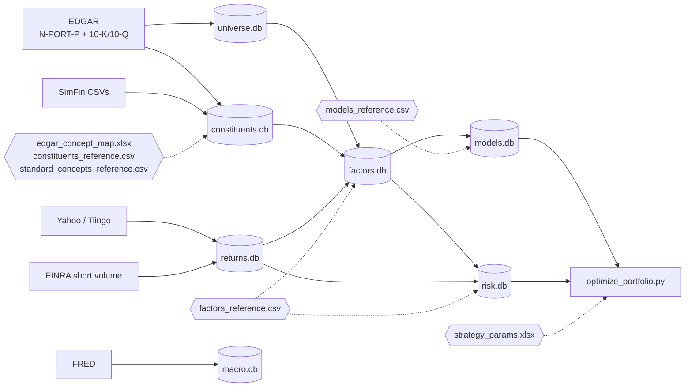

# Systematic Equity Investment Framework

&nbsp;&nbsp;&nbsp;

A systematic quantitative investing framework covering ~994 US equities from the **iShares Russell 1000 ETF** universe. Includes 30+ factors across 12 models, a Barra-style factor risk model built from first principles, and a CVXPY portfolio optimiser with 9 configurable strategies.

> **Note:** This is a public display mirror of a private working repository. It documents the full architecture, but some components are intentionally excluded — all generated data (the `data/` directory and its databases), live brokerage execution tooling, and a few private data-ingestion modules. As a result, certain files referenced below (e.g. `pipeline/update_constituents.py`) are not present here, and the pipeline is not runnable end-to-end from this repo alone. It is shared to illustrate design and methodology.

## What this covers

A fully self-contained investment research system — built from scratch in Python — that takes raw financial data from SEC filings all the way through to optimised portfolio weights. No commercial quant platform; every layer is custom.

- **Data ingestion** — pulls financial statements directly from SEC EDGAR (10-K/10-Q filings), supplemented by SimFin, Yahoo Finance, FINRA short-selling data, and FRED macro indicators
- **Factor construction** — computes 30+ quantitative measures per stock per quarter, strictly point-in-time so no snapshot contains data that wasn't yet published; banks and REITs receive sector-native factors rather than generic ones that don't apply to their business models
- **Scoring** — aggregates factors into 12 research models (profitability, value, growth, momentum, and more) with coverage-floor logic that prevents thin data from inflating scores
- **Risk modelling** — a Barra-style factor risk model built from first principles, decomposing portfolio risk into market, sector, style, and idiosyncratic components
- **Portfolio optimization** — CVXPY-powered optimizer supporting 9 strategies across three objective types; configurable entirely through a spreadsheet
- **Research & reporting** — Streamlit dashboard for interactive exploration, automated HTML reports for individual stocks and thematic baskets, and a `/model-review` diagnostic tool for auditing individual models

---

## Sample output

[**AI Industrials — thematic basket research**](https://thequantfather.github.io/quant-systematic-equity/reports/ai_industrials_theme.html) — point-in-time research (2026-05-29) on the AI capex industrial winners (Vertiv, Eaton, GE Vernova, Quanta Services, Comfort Systems, EMCOR, nVent, Hubbell, Generac, Cummins). Cap-weighted Alpha z, Barra factor exposures, performance vs benchmarks, per-name fundamentals and model-z heatmap, plus bull/bear/verdict narrative. Generated by the `/theme` skill.

---

## Architecture

The pipeline is a strict one-way dependency graph: each stage writes to its own database and reads only from upstream ones. Config lives in version-controlled CSV/XLSX files, not code — adding a new factor, model, or strategy is a config change, not a code change.

```
iShares N-PORT-P (EDGAR)
  └─ pipeline/create_universe.py      → universe.db           (company metadata, ISIN-based)

SimFin CSVs (initial load)
  └─ pipeline/create_databases.py     → constituents.db        (financial time series, PIT)

EDGAR 10-K/10-Q filings (incremental)
  └─ pipeline/update_constituents.py  → constituents.db

Yahoo / Tiingo + FINRA short volume
  └─ pipeline/create_returns.py       → returns.db             (daily prices + short interest)

constituents.db + returns.db + universe.db
  └─ pipeline/create_factors.py       → factors.db             (30+ factors × N snapshots)
  └─ pipeline/create_models.py        → models.db              (12 models × N snapshots)
  └─ pipeline/create_risk.py          → risk.db                (Ledoit-Wolf covariance)
  └─ pipeline/create_barra.py         → risk.db                (Barra factor risk model)

strategy_params.xlsx + models.db + risk.db
  └─ optimize_portfolio.py            → portfolio_output/      (weights + summary per strategy)

factors.db + models.db + universe.db + portfolio_output/ + risk.db
  └─ app.py + pages/                  → Streamlit dashboard
```

<details>
<summary><strong>Full historical build</strong></summary>

```bash
conda activate quant   # Python 3.13.5
python -m pipeline.create_universe
python -m pipeline.create_databases
python -m pipeline.create_returns
python -m pipeline.create_svr --backfill
python -m pipeline.create_factors --quarterly-backfill
python -m pipeline.create_models
python -m pipeline.create_risk --backfill
python -m pipeline.create_barra --backfill
python -m pipeline.create_strategy_params   # creates data/strategy_params.xlsx
python optimize_portfolio.py
streamlit run app.py
```

</details>

<details>
<summary><strong>Incremental update</strong></summary>

```bash
python -m pipeline.update_constituents [--limit N] [--ticker X] [--sector-type financial]
python -m pipeline.create_returns --update
python -m pipeline.create_svr
python -m pipeline.create_factors --date 2026-04-01
python -m pipeline.create_models --date 2026-04-01
python -m pipeline.create_risk --date 2026-04-01
python -m pipeline.create_barra
python optimize_portfolio.py
```

</details>

<details>
<summary><strong>Targeted commands</strong></summary>

```bash
# Rebuild universe snapshots only
python -m pipeline.create_universe --rebuild-snapshots

# Build synthetic S&P 500 3% Capped benchmark returns
python -m pipeline.create_returns --backfill-capped-benchmark sp500_3pct_capped

# Optimizer — single strategy or list all
python optimize_portfolio.py --strategy core_active
python optimize_portfolio.py --list
```

</details>

---

## Factor model

Every factor is a number that measures one specific characteristic of a company — how profitable it is, how cheaply it trades, how fast it's growing. The pipeline computes 30+ such measures for every stock at every quarterly snapshot. Factors are unsigned (direction is applied only when scoring models), cross-sectionally z-scored, and strictly point-in-time.

### Snapshot schedule

Snapshot dates are defined in a `snapshot_schedule` table in `universe.db` — no hardcoded date list. The full pipeline discovers dates automatically. The grid is month-end monthly with annual April-1 anchors (≥ 90-day lag after each December FY-end so all annual filers have reported).

### Point-in-time integrity

Every snapshot is reconstructed as it would have been on `snapshot_date`: a financial statement is only eligible once `publish_date ≤ snapshot_date` (EDGAR uses `acceptance_datetime`; SimFin uses its own publish date), with a `fiscal_year_end + 90d` fallback. Prices and Russell 1000 membership are also as of `snapshot_date`. Z-scores are computed cross-sectionally within each snapshot.

This is what makes the **Backtester** reliable: each rebalance sees only data that had actually been published by that date, so historical strategy performance carries no forward-looking contamination.

### Universal factors (30+)

| Category | Count | Factors |
|----------|:-----:|---------|
| Quality | 15 | Gross Margin, Operating Margin, Net Margin, ROE, ROA, ROIC, FCF Margin, Current Ratio, Debt-to-Assets, Interest Coverage, Accruals, Earnings Stability, Altman Z-Score, Asset Turnover, Working Capital Efficiency |
| Value | 7 | Earnings Yield, Book-to-Price, Sales-to-Price, Cash Yield, FCF Yield, EV/EBITDA, Dividend Yield |
| Growth | 5 | Revenue, Earnings, Operating Income, Cash Flow, EBITDA Growth |
| Momentum | 3 | 12M price momentum, 6M price momentum, 52-week high ratio |
| Reversal | 2 | 36–12M long-term reversal, 1M short-term reversal |
| Risk | 1 | Realized volatility |
| Size | 1 | Log Market Cap |
| Liquidity | 1 | Amihud illiquidity ratio |
| Short Interest | 2 | FINRA SVR 20-day average, SVR 90-day percentile rank |

> **Growth methodology** — each growth factor is the OLS slope of the annual LTM series over the trailing 3–5 fiscal years, scaled by mean absolute level (`slope / mean(|level|)`). This measures *sustained* growth and is robust to depressed base years — a single trough year (e.g. a bank recovering from a one-off loss) no longer produces a spurious multi-hundred-percent reading the way a naïve `(current − prior)/|prior|` ratio does.

### Sector-native factors

Standard financial ratios lose meaning for banks and REITs — a bank's revenue and a REIT's earnings aren't comparable to an industrials company's. Scoring them on generic factors mutes or distorts their model signals. These companies receive sector-native factors instead, computed and z-scored universe-wide alongside the general ones.

**Banks**

| Factor | What it measures |
|--------|-----------------|
| Net Interest Margin | Core spread profitability — interest earned minus interest paid, as % of earning assets |
| Efficiency Ratio | Cost efficiency — operating expenses ÷ revenue; lower = leaner operations |
| PPOP Return on Assets | Pre-provision earnings power — profitability before loan-loss charges |
| Credit Cost | Loan-loss provision ÷ total loans — asset quality and risk appetite |
| PPOP Yield | Pre-provision earnings relative to market cap |
| Tangible Book-to-Price | The standard bank valuation anchor (replaces generic Book-to-Price) |

**REITs**

| Factor | What it measures |
|--------|-----------------|
| FFO Payout | FFO distributed ÷ FFO generated — distribution coverage; lower payout = more retained earnings |

### Models (12 total)

Model scores are coverage-renormalised: a stock only receives full conviction if it has data for ≥ 50% of the factors applicable to its sector. Below that threshold the score is shrunk toward neutral, rather than inflated by a thin data slice.

| Model | ID | What it scores |
|-------|----|---------------|
| Profitability | PROF001 | Margins, return on capital (ROIC/ROE/ROA), FCF quality, gross-profit-to-assets; banks scored on NIM, Efficiency Ratio, PPOP RoA |
| Balance Sheet Quality | DEF001 | Earnings stability, leverage safety, interest coverage, accruals, Altman Z-Score; banks on Credit Cost; REITs on FFO Payout |
| Value | VAL001 | Earnings/FCF/cash/sales yields, book value, EV/EBITDA, dividend yield; banks on Tangible B/P + PPOP Yield; REITs on FFO Yield |
| Growth | GRO001 | Revenue, earnings, operating income, cash flow, EBITDA — all multi-year OLS trend slopes |
| Momentum | MOM001 | 12-month (60%) + 6-month (40%) risk-adjusted momentum |
| Size | SIZ001 | Log Market Cap (positive = larger firms) |
| Low Volatility | LVOL001 | Realized volatility (lower = better) |
| Liquidity | LIQ001 | Amihud illiquidity ratio (lower = more liquid) |
| Short Interest | SHI001 | FINRA SVR 20-day average (70%) + 90-day percentile rank (30%) |
| Long-term Reversal | LTR001 | 36–12M risk-adjusted reversal — standalone signal, not in Alpha |
| Short-term Reversal | STR001 | 1M risk-adjusted reversal — standalone signal, not in Alpha |
| **Alpha (composite)** | **ALP001** | **0.26 × Profitability + 0.26 × Value + 0.21 × Growth + 0.21 × Momentum + 0.06 × Size** |

Direction is applied only at model score time (`z × weight × direction`); `factor_value_z` is always stored unsigned.

---

## Barra factor risk model

The risk model answers *why* the portfolio carries the risk it does — is it a sector bet, a factor tilt, or a concentration in a few volatile stocks? Knowing the source lets the optimizer constrain each independently. The model is built from scratch following the Barra USE4 methodology.

### Decomposition

**Σ = X F X' + Δ**

| Symbol | Description |
|--------|-------------|
| X (N×K) | Factor exposure matrix — market intercept, GICS sector dummies, style z-scores, beta, fundamental factors |
| F (K×K) | Factor covariance — two-half-life EWMA. Variances: hl=90d + Newey-West (5 lags). Correlations: hl=240d. Reassembled `F = D^½ R D^½`, annualised (×252). |
| Δ (N×N) | Diagonal idiosyncratic variance — EWMA (hl=60d), Bayesian-shrunk, annualised |

### Factor structure

| Group | Count | Description |
|-------|:-----:|-------------|
| Market | 1 | Intercept (all 1s) — captures the universe-wide return premium; keeps sector factors as pure deviations |
| Sector | 11 | GICS sectors with cap-weighted sum-to-zero constraint, resolving rank deficiency vs the market factor |
| Style | 5 | Log Market Cap, 12M momentum, 6M momentum, realized vol, 52-week high ratio |
| Beta | 1 | beta_60d vs equal-weight universe |
| Fundamental | 12 | Selected quality, value, growth, and leverage factors |

### Regression

Daily cross-sectional constrained WLS: `r_t = X_t f_t + ε_t` s.t. `Σ_s w_s_cap · f_sec_s = 0`.  
WLS weights = **√mktcap** (Barra USE4 convention — anchors estimates on large, liquid names).

### Volatility Regime Adjustment (VRA)

Two bias-statistic scalars, each clipped to **[0.5, 2.0]**, applied post-estimation:

- **B²_factor** — mean of `(f_t^k / σ̂_k)²` over factors and last 60 days → scales **F**
- **B²_specific** — mean of `(ε_t^i / σ̂_i)²` over stocks and last 60 days → scales **Δ**

Healthy range: 0.8–1.2. Persistent values > 1 indicate the model is under-predicting realized volatility.

### Optimizer integration

Stacked-L form: `L_barra = vstack([L_F.T @ X.T, diag(√δ)]).T` so that `‖L_barra.T w‖² = w′(XFX′+Δ)w`.  
Set `use_barra_risk = FALSE` in the Strategies sheet of `strategy_params.xlsx` to fall back to Ledoit-Wolf for a specific strategy.

---

## Portfolio optimiser

### Strategies (9 active)

| Strategy | Objective | Alpha signal | Notes |
|----------|-----------|-------------|-------|
| Core Active | maximize_alpha | ALP001 | Benchmark-relative |
| Core Active (Strict) | maximize_alpha | ALP001 | Benchmark-relative, 2% TE cap |
| Absolute Return | maximize_alpha | ALP001 | Full universe; 17% vol cap + 20% cash buffer |
| Minimum Variance | minimize_variance | — | Full universe; ignores alpha |
| Quality Compounder | maximize_sharpe | PROF001 | Excl. Energy / Materials |
| Defensive Income | maximize_sharpe | PROF001 + LVOL001 | Full universe |
| Value Hunt | maximize_alpha | VAL001 | Benchmark-relative, 6% TE cap |
| Momentum | maximize_sharpe | MOM001 | Full universe |
| All-Weather GARP | maximize_sharpe | PROF001 + GRO001 + VAL001 | Full universe |

> **Absolute Return note** — the 17% vol cap acts as a circuit breaker in stressed markets: when the risk model forecasts portfolio volatility approaching that level, the optimizer de-risks by holding cash (up to 20%) rather than distorting the portfolio toward lower-conviction names. In normal conditions the cap doesn't bind and the portfolio is fully invested.

### Objectives

- **`maximize_alpha`** — maximises `α·w` subject to active-weight constraints vs benchmark. Optional `risk_aversion` parameter (default 0) adds a mean-variance penalty: `max α·w − ½·λ·(w−b)′Σ(w−b)`.
- **`maximize_sharpe`** — Charnes-Cooper transform: solves for `y = w/σ_p`, recovers `w = y/∑y`.
- **`minimize_variance`** — minimises `w′Σw`; ignores alpha signal entirely.

### Solvers

- **CLARABEL** — default for all continuous problems.
- **MOSEK** — activated automatically when `max_positions` or `min_position_if_held` integer constraints are in use. License required at `~/mosek/mosek.lic`.

### Configuration

All strategy settings live in `data/strategy_params.xlsx`:

| Sheet | Contents |
|-------|---------|
| **Strategies** | strategy_id, objective, risk_aversion, benchmark, alpha/risk dates, solver, universe, use_barra_risk |
| **Constraints** | Per-strategy rows — toggle `enabled` TRUE/FALSE without deleting |
| **Alpha_Weights** | Model blend per strategy; multiple model_id rows, weights normalised automatically |
| **Reference** | Read-only guide to all available models, objectives, and constraint keys |

---

## Dashboard pages

| Page | What it shows |
|------|--------------|
| Home | Universe overview — factor/model coverage, data freshness |
| Deep Dive | Single-stock deep dive — factor scores, model attribution, fundamentals, peer comparison |
| Backtester | Point-in-time strategy simulation with no look-ahead bias — rebalances, returns, risk attribution |
| Database | Raw database explorer — any table, read-only SQL query interface |
| Portfolio Optimiser | Strategy weights, sector/industry tilts, factor exposures, risk attribution |
| Risk Explorer | Barra / Ledoit-Wolf drill-down — factor correlations, vols, per-stock variance decomposition |
| Data Quality | Pipeline health — factor coverage rates, constituent fill, DB sync status, anomaly flags |
| Macro | 14 US macro signals — yields, credit spreads, commodities, economic indicators (FRED) |
| Portfolio Analytics | Live position tracking and realised P&L attribution |

---

## Databases

Seven SQLite databases — each owned by exactly one pipeline stage and consumed by downstream ones. Config tables (hexagons) are version-controlled CSV/XLSX files that define each stage's behaviour.



| Database | Primary key | Holds |
|----------|-------------|-------|
| `universe.db` | `isin` | Company metadata, point-in-time Russell 1000 membership, N-PORT accessions, capped-index snapshot weights |
| `constituents.db` | `(constituent_id, security_id, publish_date)` | Financial-statement line items with PIT publish dates |
| `returns.db` | `(isin, date)` | Daily split-adjusted prices, FINRA short-volume ratio, synthetic benchmark daily returns |
| `factors.db` | `(data_date, factor_id, security_id)` | Unsigned factor z-scores per snapshot — direction never stored here |
| `models.db` | `(data_date, model_id, security_id)` | Coverage-renormalised model scores (base + Alpha composite) |
| `risk.db` | `data_date` | Ledoit-Wolf covariance blobs + Barra factor-risk tables (F, X, Δ, VRA scalars) |
| `macro.db` | `(date, signal_id)` | 14 US macro signals with publication-lag guards against look-ahead bias |

---

## Project structure

```
├── app.py                          # Streamlit entry point
├── daily_ecosystem_update.py       # Pipeline orchestrator
├── daily_position_update.py        # Live position refresh (scheduled)
├── config.py                       # All paths, dates, and hyperparameters — single source of truth
├── db.py                           # Cached data-access layer (Streamlit @st.cache_data wrappers)
├── macro_db.py                     # Macro signal queries
├── universe_loader.py              # Point-in-time / live universe loading and ISIN remapping
├── portfolio_analytics.py          # Live-portfolio analytics backend
├── utils.py                        # Shared: get_db, classify_sector, winsorized_zscore, apply_weight_cap, get_logger
├── optimize_portfolio.py           # CVXPY optimiser — 3 objectives, 9 strategies
├── pipeline/
│   ├── create_universe.py          # universe.db — company metadata, PIT Russell 1000 snapshots
│   ├── create_databases.py         # constituents.db — initial SimFin load
│   ├── update_constituents.py      # Incremental EDGAR 10-Q/10-K fetcher
│   ├── create_returns.py           # returns.db — daily prices, splits, synthetic benchmarks
│   ├── create_svr.py               # FINRA short volume ratio
│   ├── create_factors.py           # factors.db — 30+ factors × N snapshots
│   ├── create_models.py            # models.db — 12 model scores × N snapshots
│   ├── create_risk.py              # risk.db — Ledoit-Wolf covariance
│   ├── create_barra.py             # risk.db — Barra factor risk model
│   ├── create_macro_signals.py     # macro.db — FRED macro signals
│   └── create_strategy_params.py   # Reset strategy_params.xlsx to defaults
├── pages/
│   ├── 4_Deep_Dive.py
│   ├── 6_Backtester.py
│   ├── 7_Database.py
│   ├── 8_Portfolio_Optimiser.py
│   ├── 9_Risk_Explorer.py
│   ├── 10_Data_Quality.py
│   ├── 11_Macro.py
│   └── 12_Portfolio_Analytics.py
├── scripts/
│   ├── model_review.py             # Factor diagnostics, IC, sector bias, outlier analysis
│   ├── single_name_report.py       # Per-stock HTML research report
│   ├── theme_report.py             # Thematic basket HTML report
│   ├── report_utils.py             # Shared report helpers — model names, ordering
│   ├── validate_ticker.py          # LTM financial statement validator
│   └── db_check.py                 # Pipeline health check across all databases
├── tests/
└── data/
    ├── *.db                        # Seven SQLite databases (gitignored — rebuild from pipeline)
    ├── strategy_params.xlsx        # Strategy / constraint / alpha-weight config
    ├── portfolio_output/           # Per-strategy weights + summary JSON
    ├── factors_reference.csv       # Factor definitions, directions, Barra metadata
    ├── models_reference.csv        # Model composition and weights
    ├── constituents_reference.csv  # EDGAR concept → accounting line mappings
    ├── edgar_concept_map.xlsx      # XBRL tag → standard concept mappings
    └── universe_index/             # iShares Russell 1000 holdings CSVs
```

---

## Tests

113 tests covering the layers where correctness is subtle — financial-statement parsing, factor math, the optimiser, and pipeline orchestration.

```bash
pytest tests/ -q                                          # full suite
pytest tests/ -q --ignore=tests/test_edgar_parsing.py    # fast (skips network-dependent fixtures)
```

| File | What it covers |
|------|----------------|
| `test_factor_math.py` | Q4 derivation, YTD decomposition, LTM completeness guard, winsorised z-scores |
| `test_edgar_parsing.py` | XBRL concept extraction, accounting-identity corrections, fiscal-period labelling |
| `test_optimizer.py` | Each objective respects its constraint set and returns a valid weight simplex |
| `test_daily_ecosystem_update.py` | Step dependency graph, dry-run planning, snapshot-date alignment across stages |
| `test_utils.py` | Core shared utilities — `get_db`, `classify_sector`, `winsorized_zscore` |

---

## Logging

All pipeline scripts use `get_logger(name)` from `utils.py` — no bare `print()` statements.

| Setting | Details |
|---------|---------|
| Log files | `logs/<script_name>.log` — rotating at 5 MB, 3 backups retained |
| Stdout | Every line mirrored with timestamp and level |
| Format | `YYYY-MM-DD HH:MM:SS  LEVEL  message` |
| Debug mode | `LOG_LEVEL=DEBUG python -m pipeline.create_factors --date 2026-04-01` |

---

## Dependencies

```bash
pip install streamlit pandas numpy plotly openpyxl cvxpy scikit-learn clarabel
# MOSEK (optional — integer/cardinality constraints): https://mosek.com/
```

---

*For educational and research purposes only. Not investment advice.*
