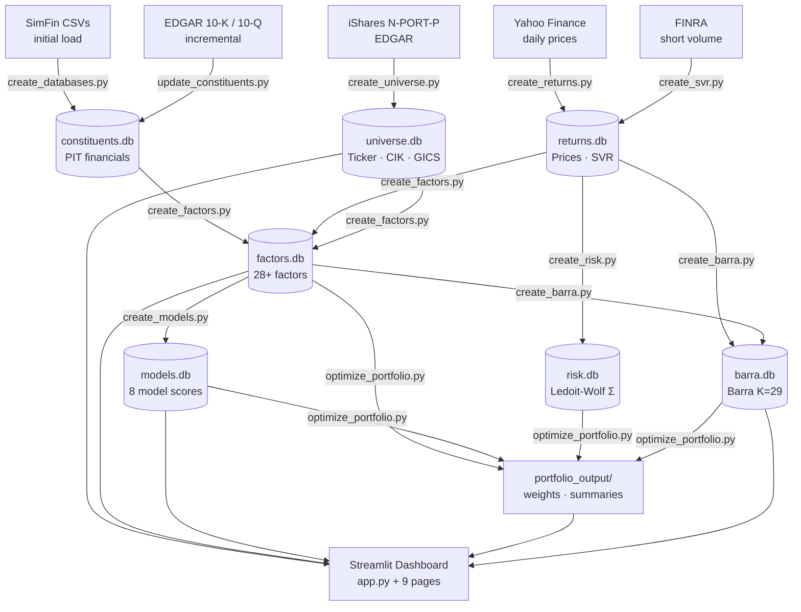

# Systematic Equity Research Platform

A production-grade quantitative investing framework covering ~1,000 US equities from the **iShares Russell 1000** universe. Built end-to-end: EDGAR/SimFin data ingestion → 28-factor model → Barra-style risk model → CVXPY portfolio optimiser → interactive Streamlit dashboard.

> **What's new**: Short Interest model (FINRA SVR), Data Quality dashboard page, GP derivation from Revenue − CoR, repeatable `--date` flags, and DB-driven universe mappings (no hardcoded ISIN/ticker dicts).


---

## What it does

| Layer | Detail |
|-------|--------|
| **Data** | Point-in-time financial statements via EDGAR 10-K/10-Q + SimFin; daily prices via Yahoo Finance; FINRA short volume |
| **Factors** | 28+ cross-sectional factors across Quality, Value, Growth, Momentum, Size, Low Vol, Liquidity, and REIT-specific categories |
| **Risk model** | Barra-style factor risk model: Σ = XFX' + Δ, K=29 factors, EWMA covariance + Newey-West + VRA |
| **Optimiser** | CVXPY: 3 objectives (maximize alpha, maximize Sharpe, minimize variance), 9 configurable strategies |
| **Dashboard** | 10-page Streamlit app — screener, factor deep-dive, backtester, portfolio analytics, risk explorer, data quality |

---

## Architecture



---

## Factor Model

### 28+ Factors across 7 categories

| Category | Count | Examples |
|----------|-------|---------|
| **Quality** | 15 | Gross Margin, ROE, ROA, Current Ratio, Interest Coverage, Leverage |
| **Value** | 5 | Earnings Yield, Book-to-Price, Sales-to-Price, Cash Yield, EV/EBIT |
| **Growth** | 5 | Revenue, Earnings, Cash Flow, Asset, Equity Growth |
| **Momentum** | 2 | 6-month, 12-month price momentum |
| **Size** | 1 | Log Market Cap |
| **Low Volatility** | 1 | Realised volatility (inverted) |
| **Liquidity** | 1 | Amihud illiquidity (inverted) |
| **REIT** | 3 | FFO Yield, FFO per Share, FFO Growth |

All factor values are stored unsigned; direction (`±1`) is applied only at model-score time.

### 9 Models

| Model | Components |
|-------|-----------|
| Quality | 15 quality factors |
| Value | 5 value factors |
| Growth | 5 growth factors |
| Momentum | 2 momentum factors |
| Size | Log Market Cap |
| Low Volatility | Realised volatility |
| Liquidity | Amihud illiquidity |
| Short Interest | FINRA SVR 20-day avg (70%) + 90-day percentile rank (30%) |
| **Alpha (composite)** | Equal-weight blend of Quality, Value, Growth, Momentum, Size |

---

## Barra Factor Risk Model

Decomposes portfolio variance as **Σ = XFX' + Δ**:

| Symbol | Description |
|--------|-------------|
| **X** (N×K) | Factor exposure matrix: 11 sector dummies + 5 style z-scores + beta + 12 fundamentals |
| **F** (K×K) | Factor covariance: EWMA (hl=90d) + Newey-West (5 lags), annualised |
| **Δ** (N×N) | Idiosyncratic variance: EWMA (hl=60d) + Bayesian shrinkage, annualised |

**Volatility Regime Adjustment (VRA)**: bias statistic B² = σ²_realised / σ²_predicted over 60 days, clipped to [0.25, 4.0]. Scales both F and Δ — automatically tightens risk estimates in high-volatility regimes.

**Optimizer integration**: stacked-L drop-in for CVXPY — `L_barra = vstack([L_F.T @ X.T, diag(√δ)]).T`. No changes needed to constraint/objective logic.

---

## Portfolio Optimiser

### 9 Configurable Strategies

| Strategy | Objective | Alpha Signal | Universe |
|----------|-----------|-------------|---------|
| Core Active | Maximize Alpha | Composite | Russell 1000 benchmark |
| Core Active (Strict) | Maximize Alpha | Composite | Russell 1000 (tight TE) |
| Absolute Return | Maximize Sharpe | Composite | Full (~983 stocks) |
| Minimum Variance | Minimize Variance | — | Full |
| Quality Compounder | Maximize Sharpe | Quality | Full (excl. Energy/Materials) |
| Defensive Income | Maximize Sharpe | Quality + Low Vol | Full |
| Value Hunt | Maximize Alpha | Value | Russell 1000 (wide TE) |
| Momentum | Maximize Sharpe | Momentum | Full |
| All-Weather GARP | Maximize Sharpe | Quality + Growth + Value | Full |

### Objectives

- **`maximize_alpha`** — active-weight SOCP vs benchmark; minimises tracking error against target
- **`maximize_sharpe`** — Charnes-Cooper transform: solve for `y = w/σ_p`, recover `w = y/∑y`
- **`minimize_variance`** — pure risk minimisation; ignores alpha signal

Strategies are configured via `data/strategy_params.xlsx` (Strategies, Constraints, Alpha_Weights sheets). No code changes needed to add a new strategy.

---

## Dashboard

| Page | Description |
|------|-------------|
| **Universe** | 994-stock universe explorer: GICS sector, market cap, factor scores |
| **Factors** | Cross-sectional factor distributions, time series, peer group comparison |
| **Screener** | Multi-factor stock screener with CSV export |
| **Deep Dive** | Single-stock factor attribution and LTM financials |
| **Themes** | Sector heatmaps and thematic opportunity sets |
| **Backtester** | Factor quintile backtests and strategy simulations |
| **Database** | Raw database explorer — all tables, all dates |
| **Portfolio** | Strategy output: weights, sector tilts, factor exposures, risk attribution |
| **Risk Explorer** | Barra / Ledoit-Wolf deep-dive: factor volatilities, stock-level decomposition |
| **Data Quality** | Pipeline health: factor coverage rates, constituent fill rates, DB sync status |

---

## Data Pipeline

### Point-in-Time Design

Financial data is anchored to `publish_date` (EDGAR `acceptance_datetime`), not fiscal year-end. Each factor snapshot only uses data published before the snapshot date — no lookahead bias.

**Q4 derivation**: EDGAR 10-Qs cover Q1–Q3 only. Standalone Q4 income/cashflow is derived in-memory from the annual 10-K: `Q4 = FY − Q1 − Q2 − Q3`. Derived rows are never written to the DB to avoid primary-key collisions.

**YTD handling**: EDGAR filers that report only cumulative 6M/9M values in XBRL are automatically decomposed to standalone quarters before LTM aggregation. YTD decomposition runs before Q4 derivation — order is mandatory.

**Gross Profit**: EDGAR XBRL rarely includes a standalone Gross Profit tag. It is derived at ingestion time as `Revenue − abs(Cost of Revenue)` when not filed directly, normalising the sign convention across filers.

### Snapshot Schedule

Six annual snapshots per factor model run, each using data published ≥ 90 days after fiscal year-end (sufficient for all Russell 1000 10-K filers):

```
2021-04-01 → FY2020    2024-04-01 → FY2023
2022-04-01 → FY2021    2025-04-01 → FY2024
2023-04-01 → FY2022    2026-04-01 → FY2025
```

---

## Quick Start

### Prerequisites

```bash
# Python 3.11+
pip install -r requirements.txt

# Optional: MOSEK licence for cardinality constraints
# https://mosek.com/products/academic-licenses/
```

### EDGAR identity (required by SEC)
```bash
export EDGAR_IDENTITY="Your Name your@email.com"
```

### Full historical build (~2–4 hours)
```bash
python create_universe.py          # ~994 companies from iShares N-PORT-P
python create_databases.py         # SimFin financial statements → constituents.db
python create_returns.py           # daily prices → returns.db
python create_svr.py --backfill    # FINRA short volume → returns.db
python create_factors.py --backfill
python create_models.py
python create_risk.py --backfill
python create_barra.py --backfill
python create_strategy_params.py   # creates data/strategy_params.xlsx
python optimize_portfolio.py
streamlit run app.py
```

### Rebuild universe snapshots (leaves companies table intact)
```bash
python create_universe.py --rebuild-snapshots
```

### Incremental update
```bash
python update_constituents.py      # new EDGAR filings (10-K + 10-Q)
python create_returns.py --update  # latest prices
python create_svr.py               # latest FINRA short volume
python create_factors.py --date 2026-04-01
python create_models.py  --date 2026-04-01   # --date is repeatable
python create_risk.py    --date 2026-04-01
python create_barra.py   --date 2026-04-01   # --date is repeatable
python optimize_portfolio.py
```

---

## Project Structure

```
├── app.py                        # Streamlit entry point
├── pages/
│   ├── 1_Universe.py             # Company metadata explorer
│   ├── 2_Factors.py              # Factor distribution and time series
│   ├── 3_Screener.py             # Multi-factor screener
│   ├── 4_Deep_Dive.py            # Single-stock attribution
│   ├── 5_Themes.py               # Sector heatmaps
│   ├── 6_Backtester.py           # Factor backtesting
│   ├── 7_Database.py             # Raw DB explorer
│   ├── 8_Portfolio.py            # Strategy output and analytics
│   ├── 9_Risk_Explorer.py        # Barra / Ledoit-Wolf risk decomposition
│   └── 10_Data_Quality.py        # Pipeline health: factor coverage, fill rates, DB sync
├── config.py                     # All paths and hyperparameters
├── db.py                         # Cached data access layer
├── utils.py                      # Shared utilities
├── create_universe.py            # Build universe.db from iShares N-PORT-P; mappings stored in DB
├── create_databases.py           # Build constituents.db from SimFin CSVs
├── update_constituents.py        # Incremental EDGAR 10-K/10-Q ingestion
├── create_returns.py             # Daily prices → returns.db
├── create_svr.py                 # FINRA short volume → returns.db
├── create_factors.py             # Factor computation → factors.db
├── create_models.py              # Model scoring → models.db
├── create_risk.py                # Ledoit-Wolf covariance → risk.db
├── create_barra.py               # Barra factor risk model → barra.db
├── create_strategy_params.py     # Reset strategy_params.xlsx template
├── optimize_portfolio.py         # CVXPY optimiser → portfolio_output/
├── daily_update.py               # Automated daily/weekly pipeline runner
├── validate_constituents.py      # Data quality diagnostics
├── scripts/
│   ├── db_check.py               # Pipeline health check across all DBs
│   └── validate_ticker.py        # LTM financials for any ticker
└── data/                         # gitignored — all databases and outputs
    ├── universe.db
    ├── constituents.db
    ├── returns.db
    ├── factors.db
    ├── models.db
    ├── risk.db
    ├── barra.db
    ├── strategy_params.xlsx
    └── portfolio_output/
```

---

## Database Schemas

```
universe.db       — isin (PK) · ticker · cik · company_name · gics_sector · simfin_id
                    + isin_patch · ticker_alias · index_registry · nport_accessions (reference tables)
constituents.db   — (constituent_id, security_id, publish_date) · value · fiscal_year · fiscal_period
returns.db        — (isin, date) · price · total_return · svr (short volume ratio)
factors.db        — (data_date, factor_id, security_id) · factor_value · factor_value_z
models.db         — (data_date, model_id, security_id) · model_value · model_value_z
risk.db           — data_date (PK) · zlib(N×N float32 covariance) · isin_list JSON
barra.db          — factor_returns · factor_covariance · idiosyncratic_vars · factor_exposures
```

---

## Tech Stack

| Component | Technology |
|-----------|-----------|
| Language | Python 3.13 |
| Storage | SQLite (7 databases, ~2GB total) |
| Data — financials | [edgartools](https://github.com/dgunning/edgartools) + SimFin |
| Data — prices | yfinance |
| Data — short interest | FINRA REGSHO via HTTP |
| Factor maths | NumPy · Pandas |
| Risk model | scikit-learn (Ledoit-Wolf) · custom Barra WLS |
| Optimisation | [CVXPY](https://www.cvxpy.org/) + CLARABEL solver |
| Dashboard | [Streamlit](https://streamlit.io/) + Plotly |
| Integer constraints | MOSEK (optional) |

---

## Disclaimer

This project is for educational and research purposes only. It is not financial advice and does not constitute a recommendation to buy or sell any security. Past performance is not indicative of future results.
